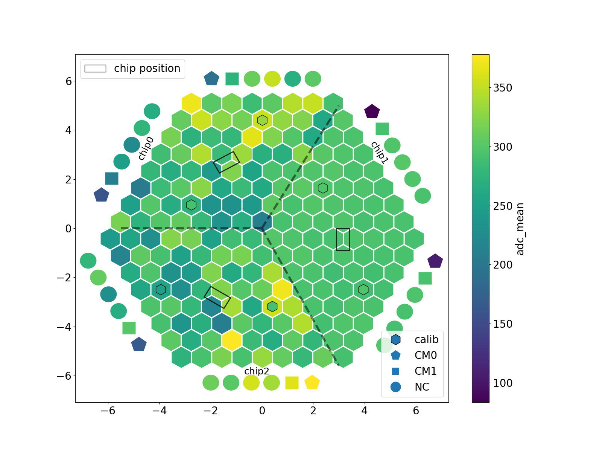
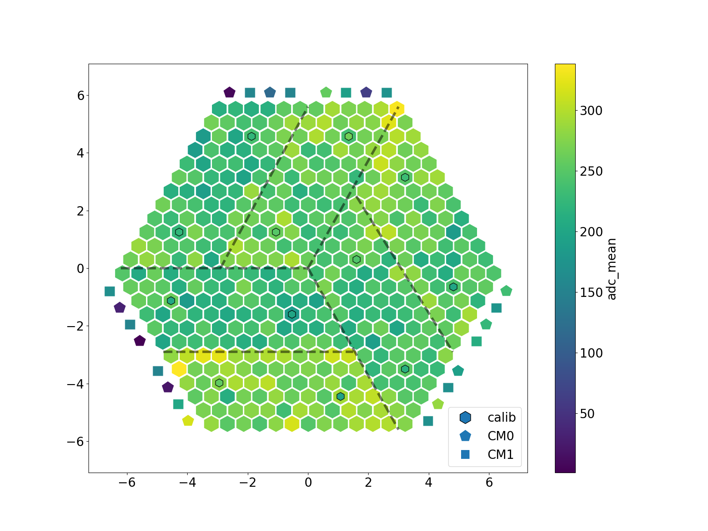

# Hexaboard mapping

Plotting of hexaboard/module data in a hexagonal geometry using python/matplotlib. 
Inspired by [ROOT-based HexPlot](https://gitlab.cern.ch/CLICdp/HGCAL/HGCAL_sensor_analysis)

## Examples
Plot with module heights
`python plot_summary.py ../HGCStudies/ModuleMeasurements/module800_ThermalStudies_08Aug21/ThermalHeights/module800DiffHeights.json -l Module800Diff -m module800DiffHeights`

### LD hexaboard

### HD hexaboard

